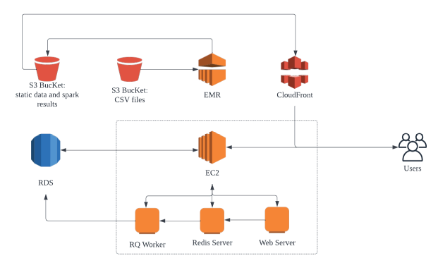

# System Architecture


The system consists of five AWS cloud services including the EC2, the RDS, two S3, the
EMR, and the CloudFront. Their corresponding functionalities are defined as follows:



## EC2
the EC2 instance includes a web server, a Redis server, and an RQ worker.


### Web Server

The Web Server stores the HTML file of our real-time driving monitor
website and distribute this file to the users via HTTP when they send a get request to
our EC2 IP address with the index path and the port 8080. After the user is loaded
with the website, the WebSocket connection between the web server and the user
will be established. Then, the server can directly send the message to the user
without the user's HTTP request. The web server will send the over speeding
notification, over speeding finish notification and the driving speed of all drivers' data
stored in the RDS in the last 30 seconds to all connected users via the WebSocket.
The user can distinguish the type of the message by the event listeners ‘data’,
‘overspeeding’, and ‘overspeedEnd’ such that the website UI can change dynamically
according to the incoming data including adding/removing overspeeding alert and
updating the real-time driving speed charts. The user can upload the real-time driving
data into the database by sending a post request with the data to our Web API
endpoint /addData. The Web API will first determine whether the driver is
overspeeding or the driver is stopped overspeeding by the features ‘isOverspeed’
and ‘isOverspeedFinished’ of the driving data. If the driver is overspeeding/stopped
overspeeding, the driver ID of the data will be send to the event listener
‘overspeeding’/‘overspeedEnd’ of all users. After the analysis of the data is finished,
the data will be stored in the Redis queues. Furthermore, the Websocker server
contains a background thread that will send the driving speed of all drivers' data
stored in the RDS in the last 30 seconds to the event listener ‘data’ per 30 seconds
after the web server is started.

### Redis Server

A Redis server is an in-memory data store. In our system, it is used
as a queue that stores the incoming add driving data messages.

### RQ Worker

An RQ worker is a background process that continuously reads and
dequeues the tasks from the given queue and waits for new tasks when all tasks are
done. Each worker can perform a job at a time. In our system, there is only one
worker (who can be easily extended) specific for completing the task of adding data
to the RDS.

## RDS

The RDS stores the driving behaviour information of all drivers such as driving speed,
time, and driver ID. The users can add new driving data via the API /addData only.

## S3 Bucket

There are two S3 buckets used in our system. One bucket stores the CSV files
about the driving behaviour information of all drivers. The CSV files are the input of the EMR
for generating the summaries to show the driving behaviour of all drivers. Another bucket
stores the results of the EMR execution, which are the summaries and the static file related
to the HTML file such as CSS files and Javascript files. This bucket is publicly read only so
that anyone can read but cannot write data. Furthermore, this bucket is connected to the
CloudFront services such that the content inside the bucket will be delivered over the
CloudFront Content Delivery Network (CDN).

## EMR

The EMR is used to run the Apache Spark framework to analyze the driving behaviour
of all drivers by using the driving data stored in the S3 bucket. The analyzed results will be
held in the public S3 bucket.

## CloudFront

The static file related to the HTML file and the analyzed results are distributed
over the CloudFront CDN. These files will be downloaded to the website after the HTML file
is loaded by using the CloudFront domain name in the URLs of the files.

# System Architecture Consideration

## Why use Websocket?

We can consider the following scenario to understand why our system uses WebSocket to
share the latest driving data. Assume three users want to monitor the driving speed of each
driver in real-time. Therefore, they send their requests to the web server per 30 seconds
interval to obtain the driving data from the next 30 seconds after the server received the last
requests. However, they are not sending their requests to the server simultaneously. This
situation leads to a problem of their received data being asynchronous. The WebSocket is
one of the solutions to solve this asynchronous problem. The WebSocket is a duplex
protocol that allows bidirectional communication between client and server. Therefore, the
web server can set a server-side timer to trigger the server to send the driving data of the
specified time frame at a defined time interval like 30 seconds in our use case.


Furthermore, the overspeeding alert and the cancellation of the overspeeding alert can be
instantaneously sent to the user without waiting for the user's request.

## Why use Redis?

If the adding data requests are directly executed in the web server, the incoming requests
may be lost when the web server is busy because it is performing the task of adding the data
into the RDS. Furthermore, the number of adding data requests is significant in a short
period, and even though all the requests can be processed perfectly, it also chokes up the
server for handling the other types of requests such as getting the HTML file. Therefore, a
message queue is used such that the web server does not need to run the time-intensive
task, and all the adding data requests stored in the queue will be executed according to their
incoming request time (first come, first serve) by the RQ worker.


## Why do not use Amazon Simple Queue Service?
We tried to use Amazon Simple Queue Service (SQS) to store the incoming add driving data
messages. However, adding driving data into the RDS is time-consuming if the system uses
the SQS as the message queue. On average, the time of adding driving data into the RDS is
about 3 seconds which does not fulfil the requirement of real-time monitoring. We think the
reason may be about the network latency because the location of the web server and the
SQS and the location of the SQS and the RQ worker is different. Then, the message takes a
long time on the transmissions before it can be handled.


## Why do not allow the user to add their driving data through RDS API?
To handle the overspeeding related issues, the system needs a listener to listen to the new
data event in the RDS and notify the web server to analyze the latest data, if the user would
add the driving data through RDS AP. Therefore, it will make the system much more
complicated and slow than the process of analyzing the latest data.
On the other hand, if the user adds the driving data through RDS API, it requires the
credential of the RDS such as a password. If we provide a credential to the user, the user
has complete control of the RDS and can perform any read and write actions. Therefore,
using the RDS API would break down the system in terms of security.

# Screenshot

## Spark Analysis


## Real Time Monitor


# Set Up Guide

 1.  Run ec2 instance
 
 2.  Create an empty directory and go to the directory 
 ```
 $ mkdir comp4442_project
 $ cd comp4442_project
 ```
 
 3.  Install the virtual environment
 ```
 $ pip3 install virtualenv
 ```
 
 4. Create a virtual environment
 ```
 $ virtualenv venv
 ```
 
 5. Activate the virtual environment
 ```
 source lab6/bin/activate
 ```
 
 6. Install dependencies
 ```
 $ sudo yum install build-essential python3-devel gcc
 ```
 
 7. Install python libraries
 ```
 $ pip3 install -r requirement.txt
 ```
 
 8. Install Redis
 ```
 $  sudo amazon-linux-extras install redis6 -y 
 ```
 
 9. config Redis
 ```
 $ sudo vi /etc/redis/redis.config
	change damemonize on
 ```
 
 10. Run application.py, redis-server, and rq worker
 ```
 $ python3 application.py
 $ redis-server
 $ rq worker
 ```
 11. write driving data 
	1. modify the URL in the writeData.py
	2. run writeData.py
```
python3 writeData.py
```
